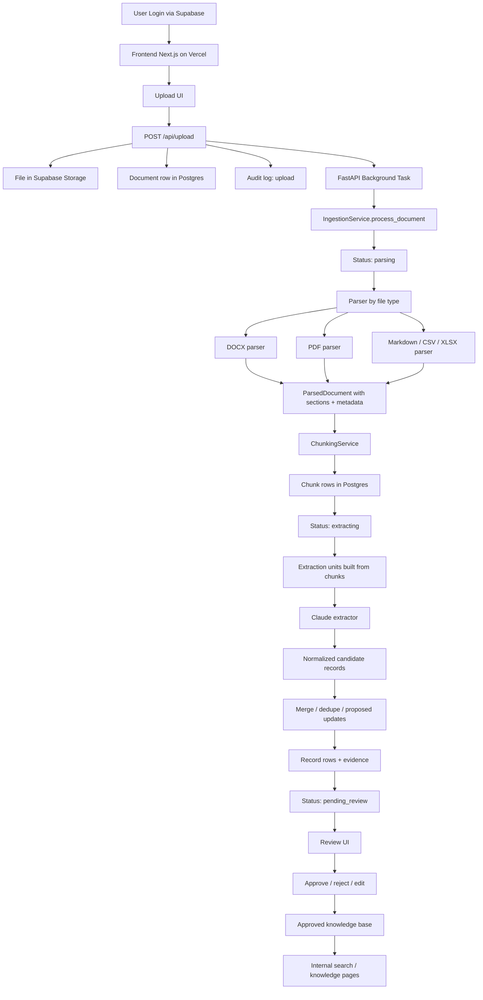
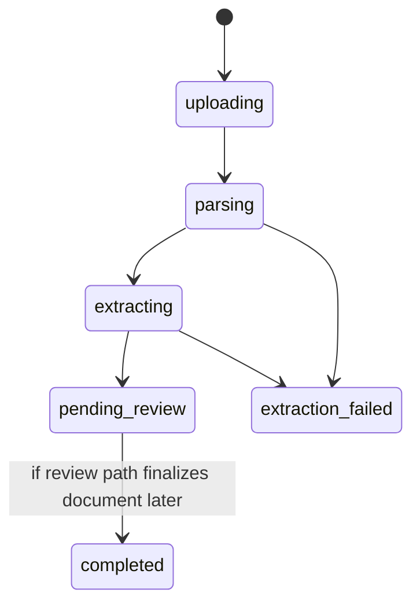
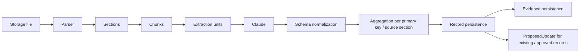

# Project Flow

Stand: 2026-03-26

Dieses Dokument beschreibt den aktuellen End-to-End-Ablauf des Jokari Knowledge Hub, gleicht ihn mit `INTERNAL_IMPLEMENTATION_PLAN.md` ab und markiert offen gebliebene Luecken.

## 1. End-to-End Ablauf

## 2. Status-Lifecycle

## 3. Technische Detailkette

## 4. Abgleich mit dem internen Plan

| Phase | Soll laut Plan | Ist-Stand | Fehlt noch |
| --- | --- | --- | --- |
| Phase 1 | Parser, Chunking, Extraktion, Schema-Fit, Evidence | Grosstenteils umgesetzt. Benchmark-DOCX wird nicht mehr als Mega-Chunk verarbeitet. Claude liefert produktionsnah plausible Multi-Produkt-Records. | Evidence-Qualitaet noch gezielt gegen reale Reviewer-Beduerfnisse pruefen. Operative Robustheit des Extraktionsjobs weiter haerten. |
| Phase 2 | Review-Workflow und Datenpflege | Basis-Review vorhanden. Proposed updates existieren technisch. | Bulk-Aktionen, bessere Filter, staerkere Dublettenlogik, klarere pending/needs_review-Regeln. |
| Phase 3 | Echte interne Suche / Retrieval | UI und einfache Suche vorhanden. | Keine echten Embeddings, kein produktiver `pgvector`-Ranker, keine semantische Suche. |
| Phase 4 | Governance / Vertraulichkeit / API-Haertung | Auth und Rollenmodell vorhanden. | `confidentiality` ist noch nicht konsequent als serverseitige Sichtbarkeitsregel durchgezogen. Admin-/Bootstrap-Pfade weiter haerten. |
| Phase 5 | Exporte / stabile interne APIs | Teilweise Read-APIs vorhanden. | Kein sauberer JSON-Export fuer freigegebene Wissensbestaende, keine robusten Exportformate/Reports. |
| Phase 6 | Tests / QA / Betriebsstabilitaet | Unit-Tests fuer Parser/Chunking/Ingestion vorhanden, lokale und produktionsnahe Smokes wurden gefahren. | API-/E2E-Abdeckung lueckenhaft, kein robuster Job-Worker mit Retry/Monitoring, kein kompletter automatisierter Hauptworkflow. |

## 5. Aktuelle Luecken, die fuer "einwandfrei funktionieren" noch relevant sind

### 5.1 Operative Extraktions-Architektur

- Der Upload laeuft derzeit ueber `FastAPI BackgroundTasks` im Webprozess.
- Das ist fuer kurze Jobs brauchbar, fuer laengere Claude-Laeufe aber fragil.
- Es gibt aktuell keine echte Queue, kein Retry-Management, keine Dead-Letter-Strategie und kein separates Worker-Scaling.

### 5.2 Beobachtbarkeit

- Es fehlen strukturierte Job-Logs pro Dokument.
- Der Dokumentstatus zeigt zwar `parsing` / `extracting`, aber keine Prozent- oder Step-Transparenz.
- Ohne gezielte Logs ist die Ursachenanalyse fuer haengende Jobs zu schwer.

### 5.3 Review-Nutzbarkeit

- Die Review-Oberflaeche ist fuer Einzelfaelle okay, aber noch nicht fuer groessere Datenmengen.
- Die Merge-Logik ist noch zu defensiv und nicht frueh genug mit Dublettenerkennung verbunden.

### 5.4 Suche

- Der wichtigste Produktnutzwert nach der Review ist das Wiederfinden.
- Solange die Suche rein textuell bleibt, ist der Nutzen fuer grosse interne Wissensbestaende begrenzt.

## 6. Empfohlene naechste Ergaenzungen

1. Extraktionsjobs aus dem Webprozess herausziehen.
   - Ziel: separater Worker-Job mit Queue, Retry und sauberem Status-Tracking.
2. Dokument-Jobstatus fachlich erweitern.
   - Ziel: `queued`, `parsing`, `chunking`, `extracting`, `persisting`, `pending_review`, `failed`.
3. Review-Workflow fuer reale Mengen verbessern.
   - Ziel: Bulk-Approve/Reject, bessere Filter, gezieltere proposed-update-Darstellung.
4. Semantische Suche aufbauen.
   - Ziel: echte Embeddings und Ranking ueber `pgvector`.
5. Export-/Read-API haerten.
   - Ziel: kontrollierte interne JSON-Exporte fuer freigegebene Daten.
6. E2E-Hauptworkflow automatisieren.
   - Ziel: Login -> Upload -> Extraktion -> Review -> Freigabe -> Suche als Smoke-Test.

## 7. Fazit

Der Kernpfad lebt bereits: Upload, Parsing, Chunking, Claude-Extraktion, Review und interne Wissensanzeige funktionieren prinzipiell. Phase 1 ist fachlich klar naeher an Produktionsreife als zuvor. Was noch fehlt, ist weniger "noch ein Parser-Fix" und mehr operative Haertung: robuste Jobausfuehrung, bessere Sichtbarkeit, staerkerer Review-Flow und echte Suche.
